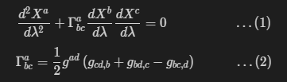
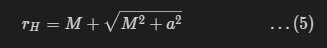
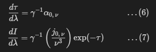
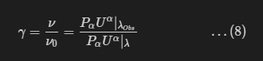

Implementation of a Ray-Tracing Module
--------------------------------------

Author: Jyotirmaya Shivottam (`JeS24 <https://github.com/JeS24>`_)

date-created: 2020 May 18 <replace with the date you submit the EPE>

date-last-revised: 2020 May 18 <keep this up to date anytime something changes>

date-accepted: TBA <replace with accepted date>

type: Standard Track <one of these four: Standard Track, Informational, Process, Governance>

status: Discussion

--------------

Abstract
--------

.. The abstract should be a short description of what the EPE will achieve.

In this EPE, I have detailed the plan for implementing a Ray-Tracing
module for Kerr and Schwarzschild spacetimes, in EinsteinPy.

--------------

Detailed description
--------------------

.. This section describes the need for the EPE.  It should describe the existing
.. problem that it is trying to solve and why this EPE makes the situation better.
.. It should include examples of how the new functionality would be used and
.. perhaps some use cases.

Our goal with this EPE is to implement a Ray-Tracing module, for Kerr
and Schwarzschild spacetimes, that does the following:

#. Helps in visualizing space-time distortion in a strong gravity region
   (here, a Black Hole or BH)
#. Obtains BH shadow in both spacetimes
#. Performs Time-Independent Radiative Transfer:

   #. To visualize Keplerian Disc/Shell with Lensing effect
   #. To calculate associated Intensities for Gravitational Redshift
      calculations

While we will be working with the aforementioned spacetimes, we aim to
keep the module general to other geometries, as well.

--------------

Branches and pull requests (If applicable)
------------------------------------------

.. Any pull requests or development branches containing work on this EPE 
.. should be linked to from here. (An EPE does not need to be implemented 
.. in a single pull request if it makes sense to implement it in discrete phases). 
.. If no code is yet implemented, just put "N/A"

This section will be updated, as and when features are implemented.

--------------

Implementation
--------------

.. This section lists the major steps required to implement the EPE.  Where
.. possible, it should be noted where one step is dependent on another, and which
.. steps may be optionally omitted.  Where it makes sense, each  step should
.. include a link related pull requests as the implementation progresses.

A. Approaches
~~~~~~~~~~~~~

There are two main ways to achieve the aforementioned goals:

#. Numerically Integrating the Geodesic Equation (References `1, 2, 3 &
   4 <????>`__)
#. Implementing a semi-analytical solution, particular to the spacetime
   (References `5 & 6 <????>`__)

A brief comparison of these approaches on relevant factors, is given
below:

+----------------------------------------------------------------------------------+----------------------------------------------------------------------------------------------------------------------------------------------------------------+
| Numerical Integration                                                            | Analytical Method (Elliptical Functions)                                                                                                                       |
+==================================================================================+================================================================================================================================================================+
| Computationally slower, as each point on the geodesic has to be evaluated        | Computationally faster, as arbitrary sections of the geodesic can be computed                                                                                  |
+----------------------------------------------------------------------------------+----------------------------------------------------------------------------------------------------------------------------------------------------------------+
| Usually less accurate (Adaptive meshing can help here)                           | Spatial accuracy independent of integration step size                                                                                                          |
+----------------------------------------------------------------------------------+----------------------------------------------------------------------------------------------------------------------------------------------------------------+
| Usually makes no assumptions on the underlying geometry                          | Makes several assumptions to make the problem analytically tractable and computationally faster                                                                |
+----------------------------------------------------------------------------------+----------------------------------------------------------------------------------------------------------------------------------------------------------------+
| Generalizable to most spacetimes, which is useful for perturbative simulations   | Analytical solutions are specific to the spacetime. Since metric and connection must be known in advance, perturbations cannot be handled in a hands-off way   |
+----------------------------------------------------------------------------------+----------------------------------------------------------------------------------------------------------------------------------------------------------------+
| Handles 3D accretion flow well                                                   | Analytical formula for 3D seems complex and computationally intensive to implement                                                                             |
+----------------------------------------------------------------------------------+----------------------------------------------------------------------------------------------------------------------------------------------------------------+
| Simpler and faster for higher dimensions                                         | Faster in most other computations                                                                                                                              |
+----------------------------------------------------------------------------------+----------------------------------------------------------------------------------------------------------------------------------------------------------------+
| Can be massively sped up by using parallel programming                           | Since calculations are implementation (Math) - specific, speed improvements are negligible                                                                     |
+----------------------------------------------------------------------------------+----------------------------------------------------------------------------------------------------------------------------------------------------------------+

Based on these factors and more importantly, since we require a general
module, we should go with a Numerical Solver. As far as computation
speed is concerned, parallel programming seems helpful in bridging the
gap between the two approaches. To these ends, after an extensive
literature review, I have the narrowed down to these papers in Numerical
Relativity:

#. `RAPTOR - Bronzwaer et al
   (2018) <https://doi.org/10.1051/0004-6361/201732149>`__ -
   `PDF <https://github.com/JeS24/einsteinpy-bleeding-edge/blob/master/Papers%20(Non-Annotated)/RAPTOR%20-%20Bronzwaer%20-%202018.pdf>`__
#. `Odyssey - Pu et al
   (2016) <https://iopscience.iop.org/article/10.3847/0004-637X/820/2/105>`__
   -
   `PDF <https://github.com/JeS24/einsteinpy-bleeding-edge/blob/master/Papers%20(Non-Annotated)/ODYSSEY%20-%20Pu%20-%202016.pdf>`__
#. `GRay2 - Chan et al
   (2018) <https://iopscience.iop.org/article/10.3847/1538-4357/aadfe5>`__
   -
   `PDF <https://github.com/JeS24/einsteinpy-bleeding-edge/blob/master/Papers%20(Non-Annotated)/GRay2%20-%20Chan%20-%202018.pdf>`__
#. `EHT Collab\* - Rummel et al
   (2019) <https://arxiv.org/abs/2001.00041>`__
   -
   `PDF <https://github.com/JeS24/einsteinpy-bleeding-edge/blob/master/Papers%20(Non-Annotated)/Numerical/EHT%20-%202001.00041.pdf>`__

\*Others are names of software packages, supplementing their work.
``EHT Collab`` is not. I am using it as a label, in this document.

We will be making use of relevant portions of these works, as described
below and cited accordingly.

B. Numerical Integration Strategies
~~~~~~~~~~~~~~~~~~~~~~~~~~~~~~~~~~~

Based on the papers, listed above, we have two strategies for the whole
problem:

1. Integrate geodesics and Time-Independent Radiative Transfer ODEs, at
   each integration step (simultaneously), like ``RAPTOR`` and
   ``Odyssey`` do.

-  Each step is computationally complex.
-  Integration needs to be performed exactly once.
-  Same step-sizes are used for both calculations, making the overall
   simulation more accurate.
-  GPU/CUDA dependency, through ``numba`` or ``cuPy`` may be needed.

2. Integrate geodesics and have a separate sub-module, that integrates
   Radiative Transfer equations, using the obtained geodesics, like we
   have done (somewhat) in the current
   ``einsteinpy.metric.Schwarzschild`` class or as in ``EHT Collab``.

-  Requires another round of integration, but this time, only on the
   calculated geodesics, instead of the affine parameter space.
-  Will be easier to troubleshoot.
-  In case, one requires only the geodesics (e.g. for plotting geodesics
   or obtaining the BH Shadow), extra computations will be avoided.
-  ``numba`` alone should be sufficient.

C. Background
~~~~~~~~~~~~~

Geometries
^^^^^^^^^^

We will be working mainly with the Kerr Metric, which is a stationary,
exact vacuum solution of the Einstein Field Equations for empty
spacetime, around an uncharged, rotating, axisymmetric BH. This is a
generalization of the Schwarzschild Metric, that is an EFE solution for
an uncharged, non-rotating BH. The rotation of the BH is accounted for,
by the Spin Parameter, :math:`a = J/M` (Angular Momentum / Mass). Under proper
scaling of units (Geometrized Units, for example), :math:`0 \le a \le 1`. 
In :math:`a \to 0` limit, we recover the Schwarzschild Metric. As such, a
single module for Kerr Null Geodesics can be extended to Schwarzschild
Null Geodesics, by simply setting :math:`a = 0`.

The Kerr Metric is usually given in Boyer-Lindquist Coordinates
(``BL``), but one other useful coordinate system is Modified Kerr-Schild
Coordinates (``KS``). We already have an implementation for
Boyer-Lindquist Coordinates in ``einsteinpy.coordinates``. We can
implement Modified Kerr-Schild similarly.

Geodesic Equation
^^^^^^^^^^^^^^^^^

The Geodesic Equation is a numerically stiff second order ODE, which can
be derived by maximizing the action in 4D spacetime, using variational
methods. It can be written succinctly using Christoffel Symbols
(:math:`\Gamma_{bc}^{a}`), as follows (N.B: Einstein Summation has been
used throughout this document):

Here, :math:`X` denotes 4-position (point on the geodesic), :math:`g` is the
metric tensor and :math:`\lambda` denotes the affine parameter. To make the
computation more accurate, easier to follow and modular to implement, we
can break down Eq. (1) into two coupled first order ODEs, per coordinate
(8 in total - :math:`X^a, U^a`):

.. image:: 3-4.png
    :align: center

Here, :math:`U` and :math:`A` are 4-velocity and 4-accelaration, respectively.

Geometrized Unit System
^^^^^^^^^^^^^^^^^^^^^^^

Using SI in Numerical Relativity is rather cumbersome due to the huge
scales involved. It is better and more "natural" to shift to Geometrized
Units, where we set :math:`G = c = 1` and scale other quantities accordingly.
We will be using these units in all the calculations in this module. For
ease-of-use, we will let users input the necessary quantities in SI and
convert them to Geometric Units implicitly. We will store the final
outputs in SI, as well.

A list of scaling factors for SI :math:`\leftrightarrow` Geometric can be found
`here <https://en.wikipedia.org/wiki/Geometrized_unit_system>`__.

Ray-Tracing
^^^^^^^^^^^

In reality, one has to consider all light rays (*Photons*) close to the
BH and evolve them according to the Geodesic Equation (Eq. (1) or (3) &
(4)) to see, which *photons* arrive at the observer's position and also,
from which direction. This is computationally intractable, given the
huge number of initial conditions to consider. To handle this
efficiently, we can instead assume, that the observer is located far
from the BH and that all rays, arriving at the observer's location, are
parallel (as is the case for cosmological observations) and trace the
*photon(s)* backwards in time (so-called *Ray-Tracing*), from the
observer's location to the BH.

D. Implementation Details
~~~~~~~~~~~~~~~~~~~~~~~~~

Camera/Image Setup
^^^^^^^^^^^^^^^^^^

For Ray-Tracing, we first set up a virtual *Camera/Image*, which
represents a consolidated view into what an observer (placed at each
pixel of the camera/image) will see. It is a 2D, flat grid of pixels
(using the aforementioned assumption), with the overall dimensions given
by *Impact Parameters*, :math:`\alpha` or ``alpha`` horizontally, and
:math:`\beta` or ``beta`` vertically. These form the coordinates in the
observer's frame. For an observer (at a pixel) who receives the ray
(photon) at an inclination angle, :math:`\theta_{Obs}` (from the BH Spin
Axis), and radial position :math:`r_{Obs} \to \infty`, the celestial
coordinates in the observer’s frame, :math:`(\alpha, \beta)` can be given
by Eqs. (16) and (17) in ``Odyssey``. So, we require :math:`\theta_{Obs}`
and :math:`r_{Obs}`, as the inputs for the placement of the null
geodesic/photon in the image.

Initial Conditions
^^^^^^^^^^^^^^^^^^

A summary of the required initial conditions is given below:

+-----------------+---------------------------------+
| Parameter       | Use                             |
+=================+=================================+
| ``r_obs``       | Distance from BH Spin Axis      |
+-----------------+---------------------------------+
| ``theta_obs``   | Inclination from BH Spin Axis   |
+-----------------+---------------------------------+
| ``a``           | BH Spin Parameter               |
+-----------------+---------------------------------+
| ``alpha``       | Horizontal Impact Parameter     |
+-----------------+---------------------------------+
| ``beta``        | Vertical Impact Parameter       |
+-----------------+---------------------------------+

Mathematically, :math:`r_{Obs} \to \infty`. For practical purposes, we will
keep ``r_obs`` sufficiently large, such that, any spacetime curvature,
in the camera/image plane, is less than the numerical tolerance of the
simulation - in other words, the flat space approximation for the
observer holds.

These parameters can be used to specify the initial conditions for the
photon, i.e. its 4-position and 4-momentum (Eqs. (3) & (4)), that we can
package together in a vector of length 8 - ``initial_photon_vector``.
Also, we will have to perform a coordinate transformation from the
observer's frame, at (:math:`\alpha, \beta`) to the BH frame, and then
perhaps a transformation to our coordinate system of choice, either BL
or KS. For initial conditions and related tasks, we can use the
equations in either Section 2.2 of ``Odyssey`` or Section 2.3 of
``RAPTOR``. At each integration step, we will compute the covariant
photon momentum and related quantities, and use these values to update a
``photon_vector``, that is a length-8 vector, storing values needed for
the next integration step. These momentum values (:math:`P_\alpha` or
:math:`k_\alpha`) will be used to perform Radiative Transfer calculations,
as described in below, under "Radiative Transfer".

A point to note here is, that the Kerr Spacetime admits 2 Killing
Vectors, leading to Energy (:math:`E`) and Angular Momentum (:math:`L_z`)
Conservation. Another composite conserved quantity or a constant of
motion is Carter's Constant, :math:`Q`. Using these, we can eliminate the
calculations, pertaining to time, :math:`t` and azimuthal angle, :math:`\phi`. This
will reduce the number of differential equations to be solved from 8 to
6 (or 5, if axisymmetry is assumed throughout the integration period).
However, this is a Kerr-specific optimization, that is not extensible to
most spacetimes. Even in Kerr spacetime, realistic models of the BH
surroundings require a :math:`\phi` dependence. So, we can either account for
these constants of motion (see ``Odyssey`` or ``EHT Collab``) or be
completely general (see ``RAPTOR]``).

Boundary Conditions
^^^^^^^^^^^^^^^^^^^

We also need to set limits on the BH itself, as getting too close to the
BH would imply photon absorption/capture into the BH. Similarly, some
photons may miss the BH by a large distance and evolve infinitely far
away from the BH. The lower (or closer) limit can be set, using the
equation for Kerr BH Event Horizon, given as follows (in Geometrized
units):

This is replaced with the expression for the Inner Most Circular Orbit
(ISCO), which is dependent on :math:`a`, while considering Radiative Transfer
calculations, vis-a-vis a Keplerian Disk. As for the outer (or farther)
limit, we can set it arbitrarily, depending on the BH features, we wish
to study. For example, for a Keplerian Disk, the outer limit is much
larger, than for plotting null geodesics.

Radiative Transfer
^^^^^^^^^^^^^^^^^^

As ray-traced photons travel close to the BH, their intensities,
:math:`I_\nu`, change due to frequency shifts caused by the motion of the
plasma. To account for this frequency shift, a correction from the
observed frequency :math:`I_{\nu,\:Obs}` to the local frequency :math:`I_\nu`
is required at every point along the ray, because physical processes
take place in the local comoving frame. For this portion of the module,
we will follow the formulation in Section 3 of ``RAPTOR`` or Section 2.3
of ``Odyssey``. Both papers use the same second order ODE with Optical
Depth (:math:`\tau`) as a parameter, however ``Odyssey`` decouples them into
two first order ODEs and ``RAPTOR`` makes some modifications to make the
integration numerically performant. We will be using these
modifications. The final set of ODEs, that will be integrated along the
geodesic (backward in time), are given below (Eqs. 30 & 31 in
``Odyssey`` or Eqs. 36 & 37 in ``RAPTOR``):

Here, :math:`j` and :math:`\alpha` are respectively, the Emission and Absorption
Coefficients, evaluated at a frequency, :math:`\nu`; and :math:`\gamma` is the
Relative Energy Shift, between radiation emitted from material
circulating around the black hole, with 4-velocity, :math:`U^\alpha`, and the
radiation, that is received by a distant observer (at
:math:`\lambda_{Obs}`). It is given as follows:

Since, we calculate the covariant 4-momentum (:math:`P_\alpha` or
:math:`k_\alpha`) at each integration step for Eqs. (3) and (4), we can use
these values directly to compute :math:`\gamma`. Eq. (8), along with Eqs. (6)
and (7) give us the photon intensities.

E. Notes:
~~~~~~~~~

#. In ``Gray2``, the authors use KS Coordinates, instead of BL. Their
   claim is that, this helps with the overall stability of the solver,
   as we do not have to worry about the polar singularities of BL
   coordinates. In addition to this, they have opened up Christoffel
   Symbols, :math:`\Gamma`, into metric derivatives and combined the
   symmetrized terms, claiming performance improvements, from doing so.
   These claims need to be verified, but nonetheless provide a potential
   source of optimization for the module.
#. In this module, we will not include Compton scattering, refraction
   effects and polarization effects due to the plasma. Optical Depth is
   the main parameter for our plasma models.

F. Module Structure
~~~~~~~~~~~~~~~~~~~

I have listed the major structural components of the module below.
Please note, that module/class/function names are subject to change, as
the module develops.

1. Null Geodesics Integrator
^^^^^^^^^^^^^^^^^^^^^^^^^^^^

First, we require a ``NullGeodesic`` class, that inherits from (a
modified version of) ``einsteinpy.Geodesic``, to solve Eqs. (3) & (4)
and get the geodesics. This will be able to simulate a photon sheet,
leading to obtaining Black Hole Shadows. A photon sheet is simply a
bundle of parallel photons, ray-traced to the BH. For this class, we can
have the following structure:

::

    NullGeodesic(Geodesic)
    |
    |--- initialize_photon() : To initialize the length-8 initial_photon_vector, at a particular pixel in the camera/image
    |
    |--- _stepsize() : Calculates optimal step-size, for the next integration step (Based on `RAPTOR`'s implementation)
    |
    |--- _connection_coef() : To calculate metric derivatives or Christoffel Symbols
    |
    |--- integrate() : Moves integration by 1 step
    |                : Calls all 3 methods

For ``integrate()``, possible pathways are:

1. Implement our own solver. Some preferable ones are:

    - RK45, with adaptive meshing - Higher accuracy, Stabler, Slower
    - Verlet Integrator - Lower accuracy, Faster
    - Adam-Bashforth-Moulton (Predictor-Corrector) Method - Medium accuracy, Most stable, Medium speed

2. Use solvers provided in ``scipy.integrate``, like:

    - ``solve_ivp``
    - ``odeint``
    - ``RK45``

2. Time-Independent Radiative Transfer
^^^^^^^^^^^^^^^^^^^^^^^^^^^^^^^^^^^^^^

For this portion, we will create a ``RadiativeTransfer()`` class, that
will inherit ``NullGeodesic()`` from earlier. We can have the following
structure for this class:

***To be updated***

::

    RadiativeTransfer(NullGeodesic)
    |
    |--- _initialize_photon() : 
    |

A noteworthy point is, if we decide to go with a ``RAPTOR``-like
implementation with simultaneous geodesic and radiative transfer
integration, ``numba`` optimizations may be insufficient and we may have
to go with CUDA/GPU code. For this, we can use ``cuPy`` or ``dask``.

References:
^^^^^^^^^^^

#. `Bronzwaer et al; RAPTOR I: Time-dependent radiative transfer in
   arbitrary spacetimes
   (2018) <https://www.aanda.org/articles/aa/full_html/2018/05/aa32149-17/aa32149-17.html>`__
#. `Chan et al; GRay2: A General Purpose Geodesic Integrator for Kerr
   Spacetimes
   (2018) <https://iopscience.iop.org/article/10.3847/1538-4357/aadfe5/meta>`__
#. `Dexter et al; A FAST NEW PUBLIC CODE FOR COMPUTING PHOTON ORBITS IN
   A KERR SPACETIME
   (2009) <https://iopscience.iop.org/article/10.1088/0004-637X/696/2/1616/meta>`__
#. `Pu et al; ODYSSEY: A PUBLIC GPU-BASED CODE FOR GENERAL RELATIVISTIC
   RADIATIVE TRANSFER IN KERR SPACETIME
   (2016) <https://iopscience.iop.org/article/10.3847/0004-637X/820/2/105/meta>`__
#. `Rummel et al; Constraining Fundamental Physics with the Event
   Horizon Telescope (2019) <https://arxiv.org/abs/2001.00041>`__
#. `Yang et al; YNOGK: A NEW PUBLIC CODE FOR CALCULATING NULL GEODESICS
   IN THE KERR SPACETIME
   (2013) <https://iopscience.iop.org/article/10.1088/0067-0049/207/1/6>`__

For a relevant literature review and runtime profiling of various
implementations, including the papers cited in this document, please
check `here <https://github.com/JeS24/einsteinpy-bleeding-edge>`__.

--------------

Backward compatibility
----------------------

.. This section describes the ways in which the EPE breaks backward compatibility.

This EPE does not break backward compatibility, but it can potentially
add to installation overheads with new dependencies, like ``cuPy`` or
``dask``. This is related to the Radiative Transfer portion of the
project.

--------------

Alternatives
------------

.. If there were any alternative solutions to solving the same problem, they should
.. be discussed here, along with a justification for the chosen approach.

Alternatives have been discussed `up here <????>`__

--------------

Decision rationale
------------------
<To be filled in by the coordinating committee when the EPE is accepted or rejected>

